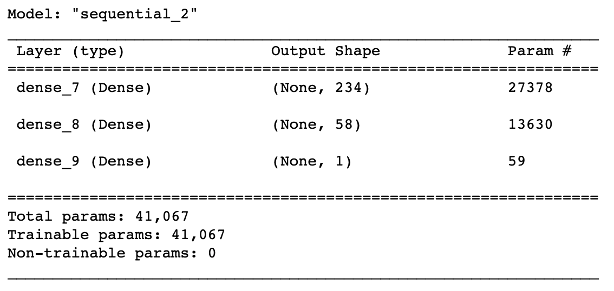

# Alphabet Soup Model

>The notebook includes three different deep learning nueral network models from tensorflow. 
* The models are trying to predict successful applicants for the venture capital firm Alphabet Soup.

---

## Technologies

Python version 3.9 
* [pandas](https://pandas.pydata.org/)
* [sklearn](https://scikit-learn.org/stable/)
* [tensorflow](https://www.tensorflow.org/)

---

## Installation Guide

```python
pip install pandas
pip install sklearn
pip install tensorflow
```

---

## Model 1 Summary


## Model 2 Summary


## Model 3 Summary



---

## Contributors

Main contributer **Santiago Hernandez**
- [dsmannight@gmail.com](dsmannight@gmail.com)

---

## License

This application is free for non-profit use.
